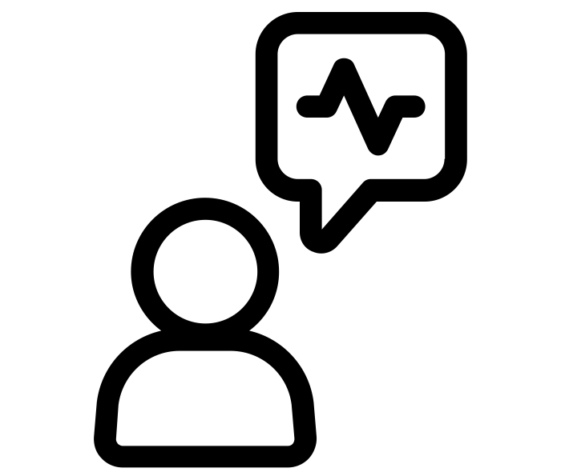

## AI Interpretability in Healthcare Scenarios

The use of AI in general and Machine Learning algorithms in particular has become ubiquitous. Of course, the use of such algorithms in the medical domain is emerging as well. Applications of machine learning techniques in medicine may include tasks like prediction of an illness and treatment suggestion for the doctors. But unlike many domains, in medicine, predictions cannot be acted upon on merely blind faith, as the consequences may be catastrophic.

In (Caruana et al., 2015) we find a classic case of how everything can go wrong - it revolves around a model intended to prioritize care among pneumonia patients trained to predict hospital readmission risk. Counterintuitively, the model learned that patients who had asthma (in addition to pneumonia) were less likely to be re-hospitalized. However, it is a known medical fact that pneumonia patients with asthma are at a *greater risk*. Imagine what could happen if the model was acted upon... 
*So what went wrong?* The data, which consist of medical records, reflected not only the severity of patients’ condition but also the quality of care, which was better for asthma patients due to the known medical risks.
We should note that such interventions are common in medicine and pose a challenge for ML in healthcare.

Although awareness for the need for an actual model interpretability has grown, numerous works in machine learning, specifically in the field of healthcare, still claim model interpretably based only on the subjective notion of "simplicity" (Lipton, 2017). ML experts are familiar with this jargon, and assume that domain experts should be familiar with it as well, without sufficient understanding of stakeholders' needs in terms of interpretability. This is referred to as "Just look how interpretable it is" (or JSHIII) approach.

Furthermore, the models' evaluation considers performance measures such as accuracy as the sole qualifier. In some cases, even if the stakeholders were consulted, their evaluation of model is limited due to lack of understanding of its behavior, so they cannot provide an expert evaluation. Thus, we should design our models in close cooperation with the domain experts (medical doctors in our case) to achieve actual interpretability of the solutions.

As defined in (Doshi-Velez and Kim, 2017), interpretability in the ML context is the ability to explain or to present in understandable terms to a human. (Keil, Rozenblit and Mills, 2004) mentions that "Explanations may highlight an incompleteness", where the incompleteness in our scenario stems from Mismatched Objective – Our algorithm tries to predict the re-hospitalization/death as an objective, where the underline ("real") objective is to predict the patient's health status.

In our work, we incorporate existing tools for interpretability of machine learning models such as LIME algorithm (Ribeiro, Singh and Guestrin, 2016) and SHAP (Lundberg and Lee, 2017) together with MMD-critic (Kim, Khanna and Koyejo, 2016), a scalable framework for informative sample selection designed to improve interpretability. More specefically: 

## Literature review:
Relying only on performance measures such as validation accuracy causes many known issues, as practitioners may overestimate their model’s accuracy (Patel et al., 2008). Therefore, understanding model's actual behavior and its reasoning by considering its interpretability has become a matter of interest (Doshi-Velez and Kim, 2017).
There are multiple papers studying interpretability that have recently proposed different approaches to address this issue. One popular method is LIME (Ribeiro, Singh and Guestrin, 2016), a model-agnostic method which provides an interpretation to specific ("local") predictions. It aims to explain any model by approximating it locally with an interpretable model. In addition, LIME authors suggest SP-LIME as an approach for sample selection by considering sample's coverage of features that were deemed important to the model. In other words, the SP-LIME attempts to select the most representative set of samples.
Another model-agnostic method for interpreting the behavior of complex models is Anchors (Ribeiro, Singh and Guestrin, 2018). This method explains model behavior by supplying a set of 'if-then' rules called anchors, representing local, sufficient conditions for specific predictions. However, medical scenarios contain a wide variety of reasons, hence patient profiles which might become overly complex while using this method. Thus, it could result in over-specific or even conflicting anchors.
In addition, the anchors rules do not imply causality yet the notion of if-then rules can be beneficial for explanation of causal features.
(Lundberg and Lee, 2017) suggest SHAP (SHapley Additive exPlanations), a unified method for interpretability, which unifies six current methods including LIME. According to the article, those methods behave in a similar manner (i.e. they have the same explanation model).
Hence, a class of additive feature attribution methods was defined. A guarantee of unique solution that shows the benefit of such unification was obtained using game theory on this class. We denote that this method is focused on features importance.
A different approach focusing on optimizing sample selection identification is MMD-critic (Kim, Khanna and Koyejo, 2016). This method suggests a framework for "prototype" and "criticism" selection to improve the interpretability of complex data distributions. Here, the prototypes are a subset of samples which are the most representative to the dataset and the criticism are samples that are not well-explained by the prototypes.
This method uses the outlines of MMD (Lloyd and Ghahramani, 2015), and its associated witness function, to find those samples.

## Methods:
Since the model is designed to operate in medical settings and expected to impact on patient care, it is crucial to examine its outputs, including predictions' confidence level. Hence, the following procedure is performed for each confidence interval separately:
[0−0.3),[0.3−0.5),[0.5,0.8),[0.8,1].

We refer to two different stages: sample-picking and local-explanations.

For the sample-picking stage, the methods selected are: 

-  **SP-Lime** - aims to select a representative samples by maximize a 'coverage' function over the dataset.
- **MMD - critic** - selects both 'critics' and 'prototypes' which allows an inquiry to model's behavior on samples which are most and least representative to the dataset.
-  **Type I & II Errors picks** – dividing the samples into groups according to the predictions error types, type-I and type-II, together with samples for which the prediction was correct. Then randomly sampling from each group.

After dividing the dataset to 4 intervals according to the confidence level assigned by the model 4 examples are sampled by each sample-pick method according as following: best 4 examples with SP-Lime, 2 prototypes and 2 critics examples with MMD-critic. With Type I & II Errors picks, the picks won't be performed per interval but per group. From each group 5 examples are randomly sampled.

For the local-explanations stage, the methods that will be examined are:
- **Lime** – which provides local explanations in comparison to perturbed data points in the proximity of the explained example.
- **SHAP** – a unification of six different interpretability methods, among them is LIME. In the available implementation SHAP can only learn feature importance over up to 200 examples from the training set. In this work the 200 examples were chosen by MMD critic as prototypes.

In order to find the best in cooperation of sample-picking and local-explanations method all the combinations are examined except incorporation of SP-Lime with SHAP.

Results are then evaluated by domain experts (i.e medical doctors).
 
 

